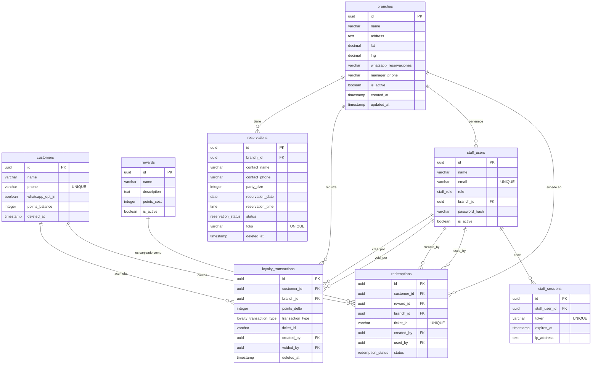
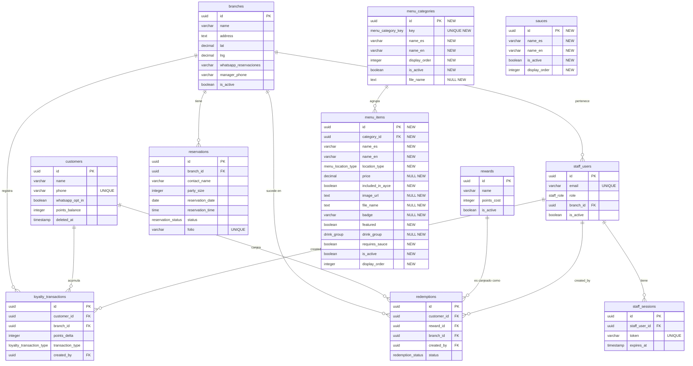

# Data Model — Menu Database Schema

**Feature**: 016 — Menu Database Schema & Migration  
**Date**: 2026-06-20

---

## Estado ANTES (migraciones 0000–0007)

---

## Estado DESPUÉS (migración 0008 — feature 016)

> Las tablas nuevas están marcadas con `[NEW]` en el comentario.

---

## Enums

### Antes (0000–0007)

| Enum | Valores |
|------|---------|
| `reservation_status` | pending, confirmed, rejected, cancelled, escalated, cancelled_auto |
| `loyalty_transaction_type` | earn, redeem |
| `redemption_status` | pending, used, expired |
| `staff_role` | staff, admin, owner |

### Agregados por feature 016 (0008)

| Enum | Valores |
|------|---------|
| `menu_location_type` | ayce, express, both |
| `menu_category_key` | entradas, burgers, sandwich, burritos, hotdogs, frio, caliente, dulce, postres, alitas, salsas, extras, bebidas |
| `drink_group` | jumbo_cocktails, cantaritos_sumo_cups, non_alcoholic, sodas, coffee_digestifs, beers_spirits |

---

## Migración 0008 — Resumen de cambios

| Objeto | Tipo | Acción |
|--------|------|--------|
| `menu_location_type` | ENUM | CREATE |
| `menu_category_key` | ENUM | CREATE |
| `drink_group` | ENUM | CREATE |
| `menu_categories` | TABLE | CREATE |
| `menu_items` | TABLE | CREATE |
| `sauces` | TABLE | CREATE |
| `menu_categories_key_idx` | UNIQUE INDEX | CREATE |
| `menu_categories_order_idx` | INDEX | CREATE |
| `menu_items_featured_active_idx` | INDEX (partial) | CREATE |
| `menu_items_category_order_idx` | INDEX | CREATE |
| `menu_items_location_type_idx` | INDEX | CREATE |
| `sauces_order_idx` | INDEX | CREATE |
